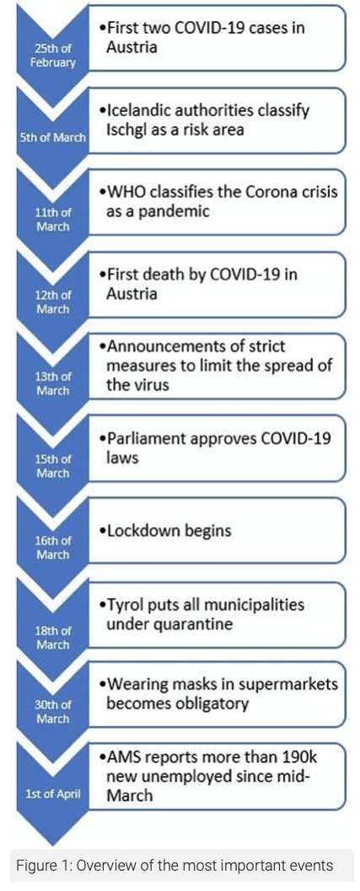

# Intervention Analysis

In this chapter we are going to learn about *intervention analysis* (sometimes also called *interrupted time-series analysis*) and to see how to conduct a intervention analysis.

**Intervention analysis** is typically conducted with the Box & Jenkins ARIMA framework and traditionally uses a method introduced by [Box and Tiao (1975)](https://www.jstor.org/stable/pdf/2285379.pdf)^[Box, G. E., & Tiao, G. C. (1975). Intervention analysis with applications to economic and environmental problems. Journal of the American Statistical association, 70(349), 70-79], who provided a framework for assessing *the effect of an intervention on a time series* under study.

As summarized by Box and Tiao: *Given a known intervention, is there evidence that change in the series of the kind expected actually occurred, and, if so, what can be said of the nature and magnitude of the change?*. In other words *Intervention analysis estimates the effect of an external or exogenous intervention on a time-series*. To conduct such an analysis, it is necessary to know the date of the intervention. 

Intervention analysis is a "quasi-experimental" design and an interesting approach to test whether *exogenous shocks*, such as, for instance, the introduction of a new policy, *impact on a time series process in a significant way*, that is, **by changing the mean function or trend** of a time series. 

Behind intervention analysis there is the *causal hypothesis* that observations *after* a **treatment** (the **"intervention"**) have a different level or slope from those before the intervention/interruption.

Besides *intervention* or *interrupted time-series analysis*, the analysis can be conducted through the *segmented regression* method. However, as in the case of traditional regression models applied to time series data, this approach does not take into account the autocorrelated structure of time series. Other methods include more complex computational approaches.

## Types of intervention

There are different types of interventions. For instance, an intervention can have an abrupt impact determining a permanent or temporary change, a sudden and short-lived change due to an event, or a more gradual yet permanent change. 

```{r  echo=FALSE, caption="Box-Steffensmeier, J. M., Freeman, J. R., Hitt, M. P., & Pevehouse, J. C. (2014). Time series analysis for the social sciences. Cambridge University Press"}
knitr::include_graphics("images/intervention.png")
```

## Intervention analysis with ARIMA

To exemplify an intervention analysis we are going to reproduce the example in the paper [Interrupted time series analysis using autoregressive integrated moving average (ARIMA) models: a guide for evaluating large-scale health interventions](https://bmcmedresmethodol.biomedcentral.com/articles/10.1186/s12874-021-01235-8#Sec13).

The data to run the analysis can be downloaded [here](https://static-content.springer.com/esm/art%3A10.1186%2Fs12874-021-01235-8/MediaObjects/12874_2021_1235_MOESM1_ESM.csv).

The example evaulates the impact of a health policy intervention (an Australian health policy intervention that restricted the conditions under which a particular medicine (quetiapine) could be subsidised). The same methodological process can be applied to evaluate any intervention in any context.

The case study is described as follows:

>(...) due to growing concerns about inappropriate prescribing, after January 1, 2014 new prescriptions for this tablet strength could not include refills. Our primary outcome was the **number of monthly dispensings** of 25 mg quetiapine, of which we had **48 months of observations** (January 2011 to December 2014). 

Thus, data comprises 48 months of observations, and the date of the intervention is January 1, 2014.

There is also seasonality in the process:

>In Australia, medicine dispensing claims have significant **yearly seasonality**. Medicines are subsidised for citizens and eligible residents through the Pharmaceutical Benefits Scheme (PBS), with people paying an out-of-pocket co-payment towards the cost of their medicines, while the remainder is subsidised. If a person’s (or family’s) total out-of-pocket costs reach the “Safety Net threshold” for the calendar year, they are eligible for a reduced co-payment for the remainder of that year. Thus, there is an incentive for people reaching their Safety Net to refill their medicines more frequently towards the end of the year. Hence, we see an *increase in prescriptions at the end of the year, followed by a decrease in January*.

The researchers hypothesize the nature of the intervention as follows (see the picture below):

>(...) due to the nature of the intervention we postulated there would be an immediate drop in dispensings post-intervention (step change), as well as a change in slope (ramp). Thus, we included variables representing both types of impacts in our model. For both impacts, h = 0 and r = 0.

In the sentence above, *h* describes when the effect happens  while *r* represents the decay pattern (see the picture below).

```{r  echo=FALSE, caption="Schaffer, A. L., Dobbins, T. A., & Pearson, S. A. (2021)"}
knitr::include_graphics("images/intervention-functions.png")
```

First we load the data, converting it to a time series format, and we visualize the time series along with a vertical lines representing the date of the intervention.  

```{r}
# Load data
quet <- read.csv(file = "./data/12874_2021_1235_MOESM1_ESM.csv")

# Convert data to time series object
quet.ts <- ts(quet[,2], frequency=12, start=c(2011, 1))

# Plot data to visualize time series
plot.ts(quet.ts, ylim=c(0, 40000), col = "blue", xlab = "Month", ylab = "Dispensings")
# Add vertical line indicating date of intervention (January 1, 2014)
abline(v=2014, col = "gray", lty = "dashed", lwd=2)

```
Next, we have to create the dummy variables representing our intervention.
This can be tricky in R. In this case, the authors convert the time of the *ts* object in a more human-readable format through the *as.yearmon* function (this is a *zoo* function and you can use it by loading the *xts* library).

```{r}
library(xts)
# Create variable representing step change and view
step <- as.numeric(as.yearmon(time(quet.ts)) >= "Jan 2014")
step
```

The above vectors is a dummy variable for the intervention. It has value equal zero before the date of the intervention, and 1 after that.

Next, in this specific case, we also want to create a variable representing a constant increasing change, capturing an increasing effect of the intervention over time. 
Also in this case the creation of the variable can be a little tricky. We create two vectors by using the *rep* and the *seq* function, and concatenate them by using the *c* function.

The argument of the *rep* function are two integers *x* and *times* (*rep(x, times)*), and the function creates a vectors that repeat ("rep") the *x* values the number of times specified by *times*. We have 36 months before the intervention, and we assign them the value zero.

```{r}
rep(0, 36)
```

Instead, we use the *seq* function to create a vectors with increasing values. This part of the variable represent a gradual increase after the intervention (we have 12 months of data after the intervention). The function *seq* takes the three arguments *from*, *to*, and *by*: *from* and *to* are the starting and end values of the sequence, *by* is the increment of the sequence. In our case we create a sequence of values that increases from 1 to 12 by 1.

```{r}
seq(from = 1, to = 12, by = 1)
```

To create the variable we need, we concatenate both the function with the *c* function, as follows:

```{r}
# Create variable representing ramp (change in slope) and view
ramp <- c(rep(0, 36), seq(1, 12, 1))
ramp 
```
We search for an appropriate ARIMA model for the data by using the *auto.arima* function (*forecast* package). We include the variables we have created as external regressors.

```{r}
library(forecast)

# Use automated algorithm to identify parameters
model1 <- auto.arima(quet.ts, xreg = cbind(step, ramp), stepwise=FALSE)

# Check residuals
checkresiduals(model1)
```

The resulting model is an *ARIMA(2,1,0)(0,1,1)[12]*.

```{r}
model1
```

We use the information retrieved from the auto.arima function to fit the same ARIMA model to the data, without including the intervention (the variables we created), using just the data up to the date of the intervention (up to January 2014). To do that, we use the *window* function in order to restrict the set of data we consider, indicating December 2013 as the end of our series.

```{r}
# To forecast the counterfactual, model data excluding post-intervention time period
model2 <- Arima(window(quet.ts, end = c(2013, 12)), order = c(2, 1, 0), 
                seasonal = list(order = c(0, 1, 1), period = 12))
```

Next, we forecast the 12 months we didn't include (starting from January 2014 until the end of the period of observation, December 2014) by using the *forecast* function (library *forecast*). The logic behind this operation is to see what would have happened to the series in the absence of the intervention. In other words, we use the prediction as a *couterfactual* in order to describe a possible effect of the intervention on the series, by determining how the observed values diverges from this forecast.

```{r}
# Forecast 12 months post-intervention and convert to time series object
fc <- forecast(model2, h = 12)

# covert the average forecast (fc$mean) in a time series object
fc.ts <- ts(as.numeric(fc$mean), start=c(2014, 1), frequency = 12)

# Combine the observed and the forecast data
quet.ts.2 <- ts.union(quet.ts, fc.ts)
quet.ts.2
```

By plotting the data, we can visualize the predicted values in the absence of the intervention (red dashed line) as well as the observed values (blue line). It seems that the health policy considerably impacted the analyzed prescriptions.

```{r}
# Plot
plot.ts(quet.ts.2, plot.type = "single", 
     col=c('blue','red'), xlab="Month", ylab="Dispensings", 
     lty=c("solid", "dashed"), ylim=c(0,40000))

abline(v=2014, lty="dashed", col="gray")
```
Coming back to our initial ARIMA model including the intervention variables, calculating also the confidence intervals and the significance of the coefficients by using the *coeftest* and the *confint* function in the *lmtest* library, we can quantify the impact of the policy. 

```{r}
library(lmtest)

model1
coeftest(model1)
confint(model1)
```

>The estimated step change was − 3285 dispensings (95% CI − 4465 to − 2104) while the estimated change in slope was − 1397 dispensings per month (95% CI − 1606 to − 1188). (The figure, ndr) shows the values predicted by our ARIMA model in absence of the intervention (counterfactual) compared with the observed values. This means that the change in subsidy for 25 mg quetiapine in January 2014 was associated with an immediate, sustained decrease of 3285 dispensings, with a further decrease of 1397 dispensings every month. In other words, there were 4682 (3285 + 1397) fewer dispensings in January 2014 than predicted had the subsidy changes not been implemented. In February 2014, there were 6079 fewer dispensings (3285 + 2*1397). Importantly, our findings should only be considered valid for the duration of the study period (i.e. until December 2014).


# Interrupted time series analysis using segmented regression

**Segmented regression** is another common way for analyzing the impact of an intervention. Two good papers explaining the methods of segmented regression are, for example: 

  - [Bernal, J. L., Cummins, S., & Gasparrini, A. (2017). Interrupted time series regression for the evaluation of public health interventions: a tutorial. International journal of epidemiology, 46(1), 348-355.](https://academic.oup.com/ije/article/46/1/348/2622842)
  - [Wagner, A. K., Soumerai, S. B., Zhang, F., & Ross‐Degnan, D. (2002). Segmented regression analysis of interrupted time series studies in medication use research. Journal of clinical pharmacy and therapeutics, 27(4), 299-309.](https://www.alnap.org/system/files/content/resource/files/main/segmented-regression-wagner-2002.pdf)

As explained by the latter, *"Segmented regression analysis uses statistical models to estimate level and trend in the pre-intervention segment and changes in level and trend after the intervention (or interventions)."*. 

More exactly, a segmented regression model is structured as follow:

$$Y = b_0 + b_1Time + b_2Intervention + b_3TimeSinceIntervention + e$$

It includes at least:

  - an outcome variable (Y); 
  - a variable that indicates the time *1,2,...,t* passed from the start of the series; 
  - a dummy variable (0/1) for observation collected before (0) or after (1) the  intervention; 
  - a variable measuring the time *1,2,...,t* passed since the intervention has occured, and which is equal to zero before the intervention.

The interpretation of coefficients is as follows:

  - $b_0$ is the baseline level at Time 0;
  - The *Time* ($b_1$) coefficient indicates the trend (the *slope*) before the intervention ( change in outcome associated with a time unit increase).
  - The *Intervention* ($b_2$) coefficient indicates the immediate effect (level change) induced by the intervention (from the last observation before the intervention to the first one after).
  - The *Time Since Intervention* ($b_3$) coefficient indicates the "sustained effect", i.e., the change in trend after the intervention (the effect for each time point that passes after the intervention). It measures *the difference* between the slope of the line before and after the intervention. It is also possible to calculate the *slope of the line after* the intervention by summing up the coefficients of Time and Time Since Treatment	($b_1 + b_3$)

## an example

The dataset *Seatbelts* in R is a time series giving the monthly totals of car drivers in Great Britain killed or seriously injured Jan 1969 to Dec 1984. Compulsory wearing of seat belts was introduced on 31 Jan 1983. Was there an impact of this legislative intervention on the number of drivers killed?

```{r}
head(Seatbelts)
```

Let's fit a segmented regression model:

$$DriversKilled = b_0 + b_1Time + b_2Intervention + b_3TimeSinceIntervention + e$$

The dataset already has an "Intervention" dummy variable ("law"). We rename it for clarity:

```{r}
Seatbelts_df <- as.data.frame(Seatbelts) # to data frame
colnames(Seatbelts_df)
colnames(Seatbelts_df)[8] <- "Intervention"
```


We can also easily add a "Time" variable.

```{r}
Seatbelts_df$Time <- 1:nrow(Seatbelts_df)
```

Then we need to add a "Time Since Intervention" variable:

```{r}
table(Seatbelts_df$Intervention) # intervention is at time point 170
TimeSinceIntervention <- c(rep(0, 169), 1:23)
Seatbelts_df$TimeSinceIntervention <- TimeSinceIntervention
```


```{r}
regTS <- lm(DriversKilled ~ Time + Intervention + TimeSinceIntervention, data=Seatbelts_df)
summary(regTS)
```

```{r}
plot.ts(Seatbelts_df$DriversKilled,
        pch=19, col="gray",
        # bty="n", 
        ylim = c(0, 250),
        xlim = c(0, nrow(Seatbelts_df)),
        xlab = "Time (months)", 
        ylab = "Drivers Killed")

# Line marking the interruption
abline(v = 170, col = "red", lty = 2)
text(110, 220, "Compulsory wearing of\nseat belts (31 Jan 1983)", 
     col="red", cex=0.8, pos=4)

# Add the regression line
lines(regTS$fitted.values, col="steelblue", lwd=2 )

```


```{r}
forecast::checkresiduals(regTS)
```


Now, let's consider the "counterfactual": what the series would be if the intervention had not occurred.

```{r}
pred1 <- predict(regTS, Seatbelts_df) # this are the fitted values of the model

# Create a dataset where Treatment and Time Since Treatment are equal to 0 (as the intervention did not occur).
dataCF <- as.data.frame(cbind(Time = Seatbelts_df$Time, 
                              Intervention = rep(0),
                              TimeSinceIntervention = rep(0))) 


pred2 <- predict(regTS, dataCF) 


```


Using the same mechanism illustrated in section 1.3 and 2.1, we can calculate the counterfactual for any point in time. The counterfactual at Time
 = 230 is the level of wellbeing at that point in time if the intervention had not occured.
 
 
```{r}
plot.ts(Seatbelts_df$DriversKilled,
     col = gray(0.5,0.5), 
     xlab = "Time (days)", 
     ylab = "Wellbeing index")

lines(rep(1:169),   pred1[1:169], col="dodgerblue4", lwd = 2 )
lines(rep(170:192), pred1[170:192], col="dodgerblue4", lwd = 2 )
lines(rep(170:192), pred2[170:192], col="darkorange2", lwd = 2, lty = 5 ) 

text(0, 45, labels = "Predicted values", pos = 4, cex = 1, col = "dodgerblue3")
text(300, 95, labels = "Counterfactual", pos = 4, cex = 1, col = "darkorange2")

# Line marking the interruption
abline(v=170, col="darkorange2", lty=2)
```
 

https://ds4ps.org/pe4ps-textbook/docs/p-020-time-series.html


## CausalImpact

While ARIMA modeling is the classic choice for intervention models, more complex computational apporaches have been developed. We can consider the Bayesian approach implemented in the package *CausalImpact* developed at *Google* to estimate causal impacts in a quasi-experimental framework (you can find here a [video presentation](https://www.youtube.com/watch?v=GTgZfCltMm8))^[CausalImpact 1.2.1, Brodersen et al., Annals of Applied Statistics (2015). http://google.github.io/CausalImpact/]. 

```{r  echo=FALSE, caption="The model used in the CasualImpact package. Image from Brodersen, K. H., Gallusser, F., Koehler, J., Remy, N., & Scott, S. L. (2015). Inferring causal impact using Bayesian structural time-series models. Annals of Applied Statistics, 9(1), 247-274."}
knitr::include_graphics("images/causal-impact.png")
```

```{r message=FALSE, warning=FALSE}
# Install and load the package
# install.packages("CausalImpact")
library(CausalImpact)
```

We use the simulated dataset used in the Google tutorial on the package, creating two time series $y$ and $x$ of length 100, simulating an abrupt intervention at time 71 determining a permanent increment of 10 points in the $y$ series.

```{r}
set.seed(1)
x1 <- 100 + arima.sim(model = list(ar = 0.999), n = 100)
y <- 1.2 * x1 + rnorm(100)
y[71:100] <- y[71:100] + 10
dat <- ts.intersect(y, x1)
```

Then, it is necessary to specify the pre-intervention and post-intervention period. In the pre-intervention period no impact is expected.

```{r}
pre.period <- c(1, 70)
post.period <- c(71, 100)
```

The function *CausalImpact* uses the values of the original time series $y$ in the pre-intervention period, and the predictors correlated to the $y$ (in this case $x$), to forecast the values that $y$ would have had without the intervention (*counterfactual*). 

To accurately forecast the $y$ values, which is necessary to obtain valid results from the analysis, it is necessary to have a proper model of the $y$ series (based on the series itself and its predictors). Then, the differences in the expected (forecasted) $y$ values without intervention, and the actual $y$ values following the intervention, are compared in order to estimate the impact of the intervention.

```{r}
impact <- CausalImpact(dat, pre.period, post.period)
```

By using the function *plot* on the resulting model, three plots are visualized: 

>The first panel shows the data and a counterfactual prediction for the post-treatment period. The second panel shows the difference between observed data and counterfactual predictions. This is the pointwise causal effect, as estimated by the model. The third panel adds up the pointwise contributions from the second panel, resulting in a plot of the cumulative effect of the intervention. (...) the above inferences depend critically on the assumption that the covariates were not themselves affected by the intervention. The model also assumes that the relationship between covariates and treated time series, as established during the pre-period, remains stable throughout the post-period.

```{r}
plot(impact)
```

Besides plotting the results, it is possible to create a summary of the model, and by adding the argument "report" inside the function *summary*, a convenient explanations of the results is printed.

```{r}
summary(impact)
```

```{r}
summary(impact, "report")
```

The authors of the package underline the importance of the statistical assumptions to get valid results, and about possible strategies to ascertain that the assumptions are met, they write the following advice:

>Here are a few ways of getting started. First of all, it is critical to reason why the covariates that are included in the model (this was x1 in the example) were not themselves affected by the intervention. Sometimes it helps to plot all covariates and do a visual sanity check. Next, it is a good idea to examine how well the outcome data y can be predicted before the beginning of the intervention. This can be done by running CausalImpact() on an imaginary intervention. Then check how well the model predicted the data following this imaginary intervention. We would expect not to find a significant effect, i.e., counterfactual estimates and actual data should agree reasonably closely. Finally, when presenting or writing up results, be sure to list the above assumptions explicitly, including the priors in model.args, and discuss them with your audience.


We can now try to use the library with the data from the previous example (the library requires data in the same format, thus some pre-processing is needed). 

```{r}
quet$month <- as.Date(quet$month, format="%d-%b-%y")
quet_xts <- xts(quet$dispensings, order.by = quet$month)
pre.period <- c(as.Date("2011-01-01"), as.Date("2013-12-01"))
post.period <- c(as.Date("2014-01-01"), as.Date("2014-12-01"))
```

We fit an automated model (without specifying a particular form for the intervention).

```{r}
impact2 <- CausalImpact(quet_xts, pre.period, post.period)
```

```{r}
plot(impact2)
```

```{r}
summary(impact)
```

```{r}
summary(impact, "report")
```

### Exercise

Let's try to analyze a real-world case study in the field of online communication.

We hypothesize that the uncertainty and anxiety caused by the pandemic has increased people's need of information. Social media are an important information source today, and the pages of the Health Ministries can be considered trustable information sources. At the same time, Facebook has favored the circulation of posts from verified health and government organization. It is therefore possible that the pages of the Ministries of Health have increased their follower base during the pandemic. 

Thus, let's try to assess the impact of the pandemic on the growth in "page likes" of some Facebook pages of Health Ministry. We'll use the *CausalImpact* library. It is the easiest solution, since we just need to indicate the intervention period, but it does not (necessarily) require other variables.

Download here the dataset of the [Facebook page of the Italian Ministry of Health](https://drive.google.com/file/d/1t4ncdNlanQwZwBvWx9AQe6R2dp-7Faew/view?usp=sharing) and save it in your *data* folder.

Some background information: On 9 March 2020, the government of Italy under Prime Minister Giuseppe Conte imposed a national lockdown. The World Health Organization (WHO) on March 11 declared COVID-19 a pandemic. For the sake of simplicity, we can use the declaration of WHO as the date of our "intervention" (more fine-grained analysis are possible as well).

Upload the data:
  
```{r}
MinisteroSalute <- read.csv("./data/MinisteroSalute.csv")
```

Let's use the *xts* format, since in this case it is easier to use (in particular, it's easier to work with the date format).

```{r}
# dates in format "date"
MinisteroSalute$beginning_of_interval <- as.Date(MinisteroSalute$beginning_of_interval)

# xts time seires
MinisteroSalute <- xts(MinisteroSalute$page_likes, 
                       order.by = MinisteroSalute$beginning_of_interval)
```

Let's take a look at the data.

```{r}
plot.xts(MinisteroSalute, col="blue",
         main="Page Likes - Italian Ministry of Health Facebook Page")
```

```{r}
start(MinisteroSalute)
end(MinisteroSalute)
```

The dates of the intervention:

```{r}
date_pre <-  c(as.Date("2018-12-30"), as.Date("2020-03-10"))
date_post <-  c(as.Date("2020-03-11"), as.Date("2020-12-31"))
```

Fit the model:

```{r}
impact2 <- CausalImpact(MinisteroSalute, 
                       pre.period =  date_pre, 
                       post.period = date_post)

```


```{r}
plot(impact2)
```

```{r}
summary(impact2)
```

```{r}
summary(impact2, "report")
```


We can also repeat the same analysis with the data from the Facebook page of the Austrian Ministry of Health ("Bundesministerium für Soziales, Gesundheit, Pflege und Konsumentenschutz - Eingang Sozialministerium"): [Download here the data](https://drive.google.com/file/d/1ogZxpKd6jLyhFRn8I1Z-Kt5gQQX7h5cH/view?usp=sharing), save it in your *data* folder, and perform the intervention analysis.

The chart below is from Markus Pollak, Nikolaus Kowarz und Julia Partheymüller (2020): [Chronology of the Corona Crisis in Austria - Part 1: Background, the way to the lockdown, the acute phase and economic consequences](https://viecer.univie.ac.at/en/projects-and-cooperations/austrian-corona-panel-project/corona-blog/corona-blog-beitraege/blog51/)

```{r}

```
